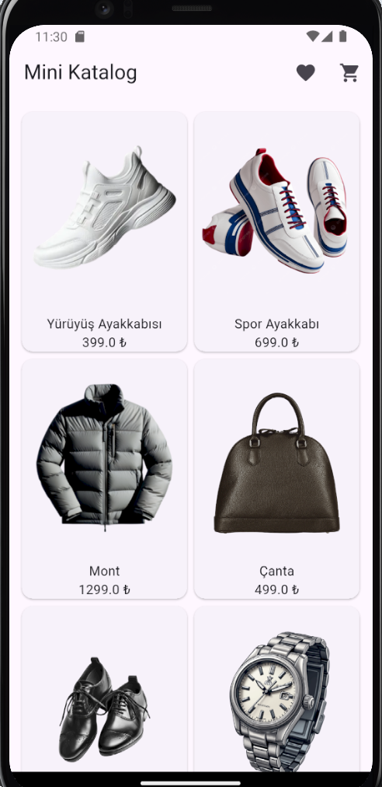
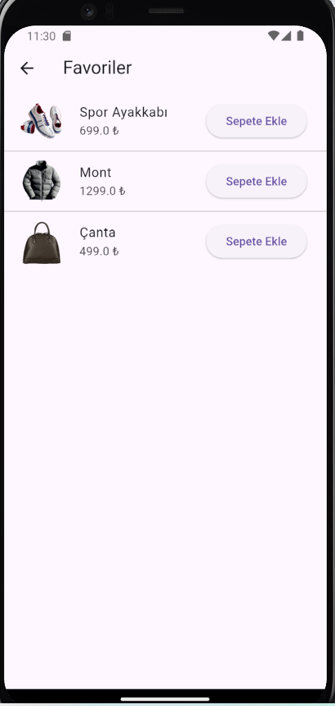
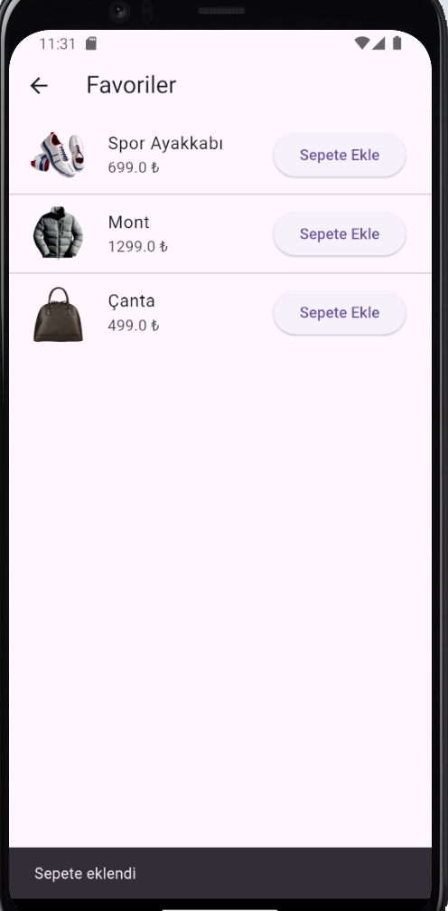
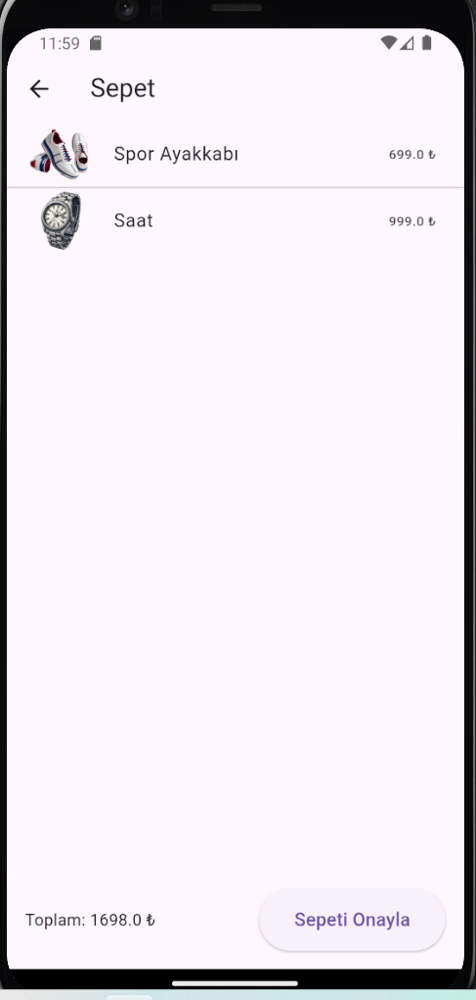
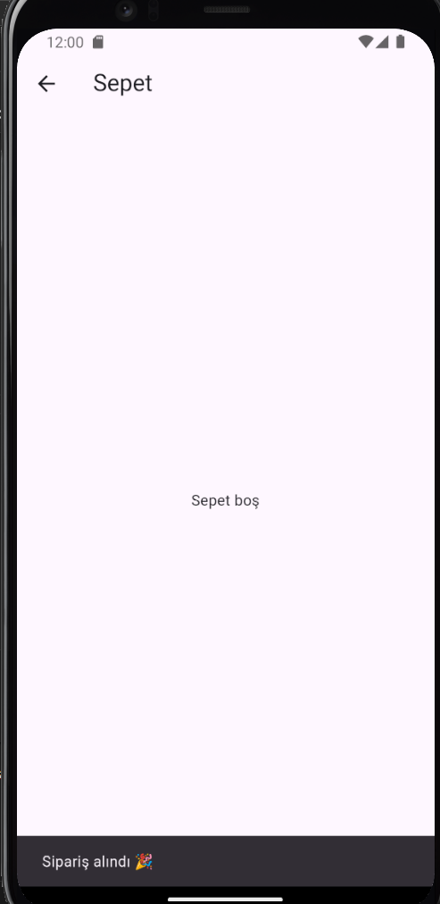

# 📱 Flutter Mini Katalog Uygulaması

Bu proje, Flutter günlük eğitimi kapsamında geliştirilmiş temel seviyede bir
**Mini Katalog / E-Ticaret Uygulaması**dır.  
Amaç; Flutter widget yapısını öğrenmek, sayfalar arası geçişleri uygulamak ve
basit bir ürün listeleme – sepet mantığını kavramaktır.

---

## 🎯 Proje Amacı

- Flutter mimarisini öğrenmek
- Widget ağacı ve UI mantığını kavramak
- Sayfalar arası geçiş (Navigator) kullanmak
- Ürün listeleme ve detay sayfası oluşturmak
- Basit sepet ve favoriler sistemi simülasyonu yapmak

---

## 🛠 Kullanılan Teknolojiler

- Flutter SDK
- Dart
- Visual Studio Code
- Android Emulator

> Ekstra paket kullanılmamıştır. Sadece material.dart kullanılmıştır.

---

## 📦 Uygulama Özellikleri

✅ Ürün listeleme (GridView)  
✅ Ürün detay sayfası  
✅ Favorilere ekleme  
✅ Sepete ekleme  
✅ Sepet sayfası  
✅ Toplam tutar hesaplama  
✅ Sipariş onaylama (simülasyon)  
✅ Asset görseller kullanımı  
✅ Navigator ile sayfa geçişleri

---

## 📸 Uygulama Görselleri

  
  
  
  
  

---

## 🗂 Proje Yapısı

lib/ ├─ models/ │ └─ product.dart ├─ pages/ │ ├─ home_page.dart │ ├─
detail_page.dart │ ├─ favorites_page.dart │ └─ cart_page.dart └─ main.dart

assets/ └─ images/
